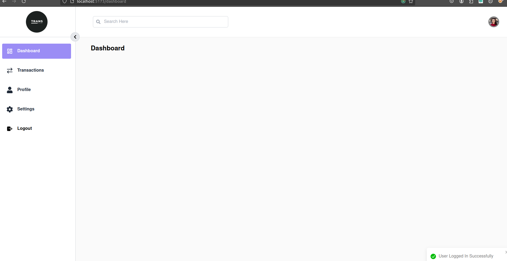

# Transaction Manger React App

# Frontend Architecture Document:

## Product

The product is a transaction management system built using React and Redux Toolkit (RTK) for managing transactions efficiently.

## Technologies

1. TypeScript: The primary programming language for type safety and enhanced developer experience.
2. RTK Query: For efficient data fetching, caching, and synchronization, simplifying API interactions.
3. Tailwind CSS: For utility-first CSS styling, allowing rapid and customizable UI development.
4. Prettier: For consistent code formatting and maintaining code quality.
5. React Router: For handling routing and navigation within the application.

## Project installation

    Navigate to the project directory:** Open a terminal and navigate to your project directory where the "package.json" file is located.

1.  Install project dependency:

        npm install

2.  Start the development server:

        npm run dev

### Screen Shot
Login Page

Dashboard Page

Transaction Page

